# Daily Reflection Tree — Visual Diagram

```mermaid
flowchart TD
    START([🌙 START\nWarm greeting]) --> A1_OPEN

    subgraph AXIS1["AXIS 1 — Locus: Victim ↔ Victor"]
        A1_OPEN[/Q: Car seat metaphor\nfor today/]
        A1_D1{Route by\nanswer}
        A1_Q_AGENCY_HIGH[/Q: What made it\nwork out?/]
        A1_Q_AGENCY_LOW[/Q: First instinct\nwhen things got hard?/]

        A1_D2_HIGH{Lucky\nor not?}
        A1_D2_LOW{Some agency\nfound?}

        A1_Q_CHOICE_HIGH[/Q: Pivotal moment —\ndid you make a call?/]
        A1_Q_CHOICE_LUCKY[/Q: Did you make\nluck more likely?/]
        A1_Q_CHOICE_LOW[/Q: One small thing\nyou could have changed?/]

        A1_D3_LUCKY{Agency\nlatent?}
        A1_D4_LOW{Genuinely\nconstrained?}

        A1_R_STRONG_INT[💬 Reflection:\nDeliberate agency]
        A1_R_LATENT_INT[💬 Reflection:\nLuck ≠ passivity]
        A1_R_EXT_SOFT[💬 Reflection:\nBuilding the door]
        A1_R_EXT_WITH_AGENCY[💬 Reflection:\nSearching within constraint]
        A1_R_EXT_GROWING[💬 Reflection:\nHindsight → foresight]
        A1_R_EXT_VALID[💬 Reflection:\nHonest constraint naming]
    end

    BRIDGE_1_2([→ Bridge: How you reacted\nto what you gave])

    subgraph AXIS2["AXIS 2 — Orientation: Entitlement ↔ Contribution"]
        A2_OPEN[/Q: Last hour —\ngive or expect?/]
        A2_D1{Contribution\nor Entitlement?}
        A2_Q_CONTRIB_HIGH[/Q: One thing you gave\nthat wasn't required/]
        A2_Q_ENTITLEMENT[/Q: When did the\nunrecognised feeling begin?/]
        A2_Q_ENTITLEMENT_FOLLOW[/Q: Were you too\nfocused on score\nto show up for others?/]
        A2_D2_ENT{Self-aware\nor not?}
        A2_R_CONTRIB[💬 Reflection:\nOCB — the invisible tissue]
        A2_R_ENT_AWARE[💬 Reflection:\nNaming = first step]
        A2_R_ENT_HOLDING[💬 Reflection:\nOne act resets the ledger]
    end

    BRIDGE_2_3([→ Bridge: Beyond you,\nbeyond your circle])

    subgraph AXIS3["AXIS 3 — Radius: Self-centric ↔ Altrocentric"]
        A3_OPEN[/Q: Who is in the frame\nof today's key moment?/]
        A3_D1{Radius\nwidth?}
        A3_Q_SELF[/Q: Necessary narrowing\nor default habit?/]
        A3_Q_TEAM[/Q: Did you notice\nsomeone who had it harder?/]
        A3_Q_TRANSCEND[/Q: What brought the\nwider view into focus?/]
        A3_D2_SELF{Valid sprint\nor habit?}
        A3_D2_TEAM{Noticed\n& acted?}
        A3_Q_SELF_NUDGE[/Q: Someone affected by\nyour day you haven't\nthought about since?/]
        A3_R_SELF_VALID[💬 Reflection:\nFocus is valid — re-entry matters]
        A3_R_SELF_WIDENING[💬 Reflection:\nMeaning expands with concern]
        A3_R_TEAM_HIGH[💬 Reflection:\nMoving toward difficulty]
        A3_R_TEAM_NUDGE[💬 Reflection:\nOne glance tomorrow]
        A3_R_TRANSCEND[💬 Reflection:\nPerspective as habit]
    end

    SUMMARY([📋 SUMMARY\nPersonalised synthesis\nof all 3 axes])
    END([✓ END\nClosing message])

    A1_OPEN --> A1_D1
    A1_D1 -->|Driving/Co-pilot| A1_Q_AGENCY_HIGH
    A1_D1 -->|Back seat/Trunk| A1_Q_AGENCY_LOW
    A1_Q_AGENCY_HIGH --> A1_D2_HIGH
    A1_D2_HIGH -->|Intentional| A1_Q_CHOICE_HIGH
    A1_D2_HIGH -->|Lucky| A1_Q_CHOICE_LUCKY
    A1_Q_CHOICE_HIGH --> A1_R_STRONG_INT
    A1_Q_CHOICE_LUCKY --> A1_D3_LUCKY
    A1_D3_LUCKY -->|Latent agency| A1_R_LATENT_INT
    A1_D3_LUCKY -->|Genuine luck| A1_R_EXT_SOFT
    A1_Q_AGENCY_LOW --> A1_D2_LOW
    A1_D2_LOW -->|Looked for influence| A1_R_EXT_WITH_AGENCY
    A1_D2_LOW -->|Waited/Stuck| A1_Q_CHOICE_LOW
    A1_Q_CHOICE_LOW --> A1_D4_LOW
    A1_D4_LOW -->|Some agency seen| A1_R_EXT_GROWING
    A1_D4_LOW -->|Genuinely constrained| A1_R_EXT_VALID

    A1_R_STRONG_INT & A1_R_LATENT_INT & A1_R_EXT_SOFT & A1_R_EXT_WITH_AGENCY & A1_R_EXT_GROWING & A1_R_EXT_VALID --> BRIDGE_1_2

    BRIDGE_1_2 --> A2_OPEN
    A2_OPEN --> A2_D1
    A2_D1 -->|Contribution| A2_Q_CONTRIB_HIGH
    A2_D1 -->|Entitlement| A2_Q_ENTITLEMENT
    A2_Q_CONTRIB_HIGH --> A2_R_CONTRIB
    A2_Q_ENTITLEMENT --> A2_Q_ENTITLEMENT_FOLLOW
    A2_Q_ENTITLEMENT_FOLLOW --> A2_D2_ENT
    A2_D2_ENT -->|Aware| A2_R_ENT_AWARE
    A2_D2_ENT -->|Holding| A2_R_ENT_HOLDING

    A2_R_CONTRIB & A2_R_ENT_AWARE & A2_R_ENT_HOLDING --> BRIDGE_2_3

    BRIDGE_2_3 --> A3_OPEN
    A3_OPEN --> A3_D1
    A3_D1 -->|Just me| A3_Q_SELF
    A3_D1 -->|Team| A3_Q_TEAM
    A3_D1 -->|Outside circle| A3_Q_TRANSCEND
    A3_Q_SELF --> A3_D2_SELF
    A3_D2_SELF -->|Valid sprint| A3_R_SELF_VALID
    A3_D2_SELF -->|Habit| A3_Q_SELF_NUDGE
    A3_Q_SELF_NUDGE --> A3_R_SELF_WIDENING
    A3_Q_TEAM --> A3_D2_TEAM
    A3_D2_TEAM -->|Noticed & helped| A3_R_TEAM_HIGH
    A3_D2_TEAM -->|Noticed, didn't act| A3_R_TEAM_NUDGE
    A3_Q_TRANSCEND --> A3_R_TRANSCEND

    A3_R_SELF_VALID & A3_R_SELF_WIDENING & A3_R_TEAM_HIGH & A3_R_TEAM_NUDGE & A3_R_TRANSCEND --> SUMMARY
    SUMMARY --> END

    style AXIS1 fill:#f0f4ff,stroke:#4a6fa5
    style AXIS2 fill:#f0fff4,stroke:#4a9060
    style AXIS3 fill:#fff8f0,stroke:#a06030
    style START fill:#2d3748,color:#fff
    style END fill:#2d3748,color:#fff
    style SUMMARY fill:#553c9a,color:#fff
```

## Node Type Legend

| Symbol | Type |
|--------|------|
| `([...])` | start / end / bridge / summary |
| `[/..../]` | question (parallelogram — user input) |
| `{...}` | decision (internal routing, invisible to user) |
| `[💬 ...]` | reflection (insight/reframe shown to user) |
